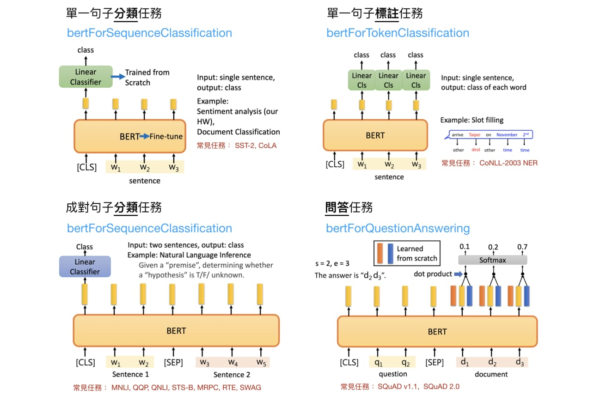

### BERT Named Entity Recognition

Named entities are phrases that contain the names of persons, organizations, locations, times and quantities.

* U.N. (organization) official Ekeus (person) heads for Baghdad (location)

The dataset **CoNLL-2003** concerns named entity recognition is used. There are four types of named entities: persons, locations, organizations and names of miscellaneous entities that do not belong to the previous three groups. The named entity tags have format B-TYPE, I-TYPE, O. The first word of the entity will have tag B-TYPE. I-TYPE means that the word is inside an entity of type TYPE. A word with tag O is not part of any entities.

There are 9 entity tags in this task (B-LOC, B-PER, B-ORG, B-MISC, I-LOC, I-PER, I-ORG, I-MISC, O). Here is an example:
* AL-AIN B-LOC
* , O
* United B-LOC
* Arab I-LOC
* Emirates I-LOC
* 1996-12-06 O

#### Evaluate the trained NER model based on BERT

test_sentence:
The European Commission said on Thursday it disagreed with German advice to consumers to shun British lamb until scientists determine whether mad cow disease can be transmitted to sheep.

test result:
```
O	[CLS]
O	The
B-ORG	European
I-ORG	Commission
O	said
O	on
O	Thursday
O	it
O	disagreed
O	with
B-MISC	German
O	advice
O	to
O	consumers
O	to
O	shun
B-MISC	British
O	lamb
O	until
O	scientists
O	determine
O	whether
O	mad
O	cow
O	disease
O	can
O	be
O	transmitted
O	to
O	sheep
O	.
O	[SEP]
```




#### See also

* [Transformer](https://youtu.be/ugWDIIOHtPA)
* [ELMO, BERT, GPT2](https://youtu.be/UYPa347-DdE)
